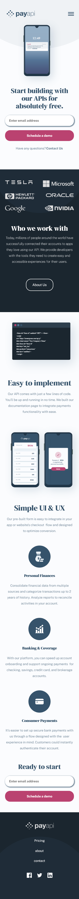
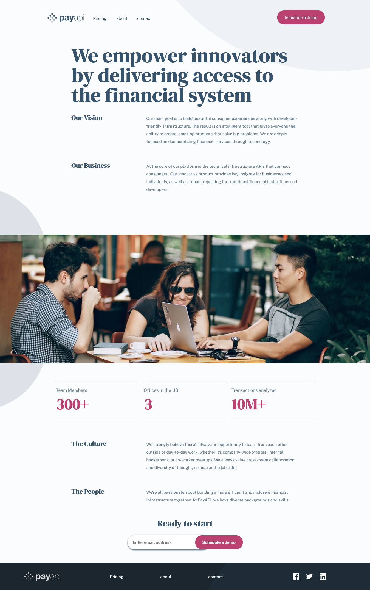

# PayAPI Marketing Site

## Links

- See The Live URL: [Payapi](https://unruffled-colden-5c0403.netlify.app/)

### Built with

- Semantic HTML5 markup
- CSS custom properties
- React components
- Sass modules
- Flexbox
- CSS Grid
- Mobile-first workflow
- Responsive web design

### What I learned

**setting dart sass in react app**
[set up instructions](https://medium.com/nerd-for-tech/add-sass-to-your-react-app-in-2021-here-is-how-c7260c323a5a)

**centering an absolute positioned element**
  - Add left: 50% to the element that you want to center. You will notice that this aligns the left edge of the child    element with the 50% line of the parent.
  - Add a negative left margin that is equal to half the width of the element. This moves us back onto the halfway mark.
  - Next, we’ll do a similar process for the vertical axis. Add top: 50% to the child
  - And then add a negative top margin equal to half its height.

[how to center an absolute positioned element](https://thoughtbot.com/blog/positioning)

### Continued development

- improvement form validation
- checkbox to match design - by creating a custom checkbox

### Useful resources

- [React router dom](https://reactrouter.com/web/guides/quick-start) - navigation between pages

### Screenshot (Design preview)

